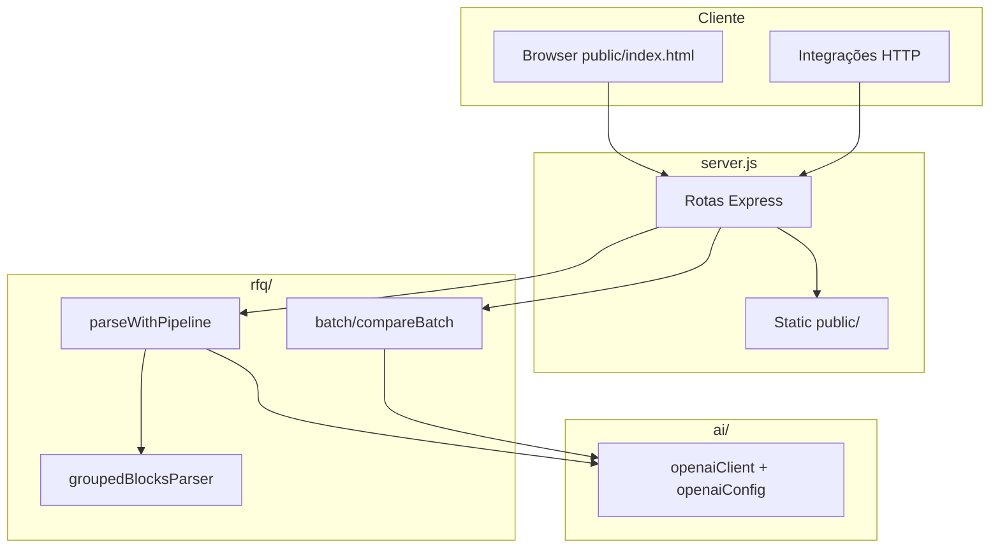

# Suprimentos Dream

Aplicação **Node.js + Express** para leitura de planilhas Excel de cotações (RFQ), comparação de fornecedores e assistência opcional via **OpenAI** (sempre como complemento ao processamento determinístico).

---

## Índice

1. [Visão geral](#visão-geral)
2. [Documentação em `docs/`](#documentação-em-docs)
3. [Arquitetura](#arquitetura)
4. [Estrutura de pastas](#estrutura-de-pastas)
5. [Fluxos de funcionamento](#fluxos-de-funcionamento)
6. [Configuração (`.env`)](#configuração-env)
7. [API — rotas principais](#api--rotas-principais)
8. [Interface web](#interface-web)
9. [Testes](#testes)
10. [Troubleshooting](#troubleshooting)

---

## Visão geral

| Capacidade | Descrição |
|------------|-----------|
| **Parse de cotação** | Lê `.xlsx`, detecta aba/cabeçalho, mapeia colunas (fuzzy), normaliza moeda BR e unidades. |
| **Pipeline RFQ** | Roteamento por layout (ex.: vários fornecedores na mesma planilha “grouped”). |
| **Comparação em lote** | Vários arquivos → consolidação por `item_key`, ranking, export Excel, revisão assistida. |
| **OpenAI (opcional)** | Ambiguidade de layout, resumo analítico, equivalência semântica de itens no batch — nunca substitui o motor determinístico de ranking/totais. |

**Stack:** Node 16+, Express, SheetJS (`xlsx`), ExcelJS (export), SDK OpenAI (Responses API + JSON estruturado), frontend estático em `public/`.

---

## Documentação em `docs/`

Toda a documentação de contrato e de exportação está na pasta **`docs/`** (índice: **[docs/README.md](docs/README.md)**).

| Arquivo | Assunto |
|---------|---------|
| [docs/integration-schema.md](docs/integration-schema.md) | Schema JSON do parse (`/api/parse`, `/rfq/parse`), campos, erros. |
| [docs/batch-observability.md](docs/batch-observability.md) | Batch: histórico, métricas, decisão manual, fluxo `compare-batch`. |
| [docs/batch-xlsx-export.md](docs/batch-xlsx-export.md) | Abas e colunas do XLSX gerado pelo compare-batch. |
| [docs/document-ingest.md](docs/document-ingest.md) | PDF/DOCX/TXT: extração de texto + IA (`OPENAI_ENABLE_DOCUMENT_INGEST`). |

Na **raiz** existem atalhos (`INTEGRATION_SCHEMA.md`, `BATCH_OBSERVABILITY.md`) que apontam para esses arquivos. O atalho `rfq/batch/BATCH_XLSX.md` aponta para `docs/batch-xlsx-export.md`.

---

## Arquitetura



- **Determinístico:** parse, consolidação, `compareSuppliersFromLegacy` / ranking.
- **OpenAI:** chamadas condicionais; falha ou ausência de chave → fallback sem quebrar o pipeline.

---

## Estrutura de pastas

```
compras-dream/
├── docs/                      # Documentação de integração e batch (ver docs/README.md)
├── public/                    # Frontend (index.html, js/batch-result-ui.js)
├── ai/                        # Config e cliente OpenAI (Responses API, schemas)
├── rfq/
│   ├── batch/                 # Compare-batch: compareBatch, consolidate, export, semantic*, métricas
│   ├── pipeline.js            # Orquestração do parse
│   ├── templates/             # Parsers por layout (ex.: grouped)
│   ├── normalize/             # Dinheiro, texto
│   └── ...
├── test/                      # Testes Node (node:test)
├── server.js                  # Entrada HTTP
├── package.json
├── .env.example
└── README.md                  # Este arquivo
```

---

## Fluxos de funcionamento

### 1) Parse de um arquivo (`POST /api/parse`)

1. Upload multipart com Excel.
2. `parseWithPipeline` escolhe o caminho (template grouped ou legado).
3. Retorno: `canonical_quotation`, `items`, `validation_result`, `warnings`, opcionalmente `analytic_summary` se OpenAI ativo.

Detalhes do JSON: **[docs/integration-schema.md](docs/integration-schema.md)**.

### 2) Parse por URL (`POST /rfq/parse`)

Mesmo modelo de resposta; entrada JSON com `file_url`, `rfq_id`, etc. Uso típico: integrações externas / Worker.

### 3) Comparação em lote (`POST /api/compare-batch`)

1. Vários arquivos (limite validado em `validateBatch`).
2. Parse por arquivo → `extractSupplierQuotes` → `consolidateQuotes`.
3. Opcional: **equivalência semântica** (`semanticItemMatch.js`) se flags + chave OpenAI.
4. Inconsistências, colisões de `item_key`, ranking.
5. Opcional: **resumo analítico** OpenAI sobre o resultado já calculado (não altera números).
6. `buildReviewSummary`, `exportBatchWorkbook`, histórico em disco, resposta JSON (modo slim ou debug).

Observabilidade e decisão humana: **[docs/batch-observability.md](docs/batch-observability.md)**.  
Layout do Excel: **[docs/batch-xlsx-export.md](docs/batch-xlsx-export.md)**.

### 4) Feedback “IA solicitada mas indisponível”

O payload de sucesso pode incluir `ai_comparison_feedback` (mensagem para o usuário quando a IA foi esperada mas não houve resumo válido, etc.).

---

## Configuração (`.env`)

1. Copie `.env.example` para `.env`.
2. **`OPENAI_API_KEY`**: única variável obrigatória para **qualquer** chamada à API OpenAI; sem ela o sistema permanece 100% determinístico.
3. Demais variáveis (modelo, timeouts, `OPENAI_ENABLE_*`, `OPENAI_ENABLE_SEMANTIC_ITEM_MATCH`, etc.) têm defaults em `ai/openaiConfig.js`.

Comentários e lista completa: **`.env.example`**.

---

## API — rotas principais

| Método | Rota | Uso |
|--------|------|-----|
| GET | `/ping` | Health / trace |
| GET | `/health`, `/ready` | Prontidão |
| POST | `/api/parse` | Upload Excel → parse pipeline |
| POST | `/rfq/parse` | Parse via `file_url` (JSON) |
| POST | `/api/compare` | Comparador legado / Tess (conforme `server.js`) |
| POST | `/api/compare-batch` | Lote multi-arquivo + XLSX |
| GET | `/api/compare-batch/:batchId` | Histórico do lote (API key se configurada) |
| POST | `/api/compare-batch/:batchId/decision` | Decisão manual approved/rejected |
| GET | `/downloads/:fileName` | Download de export (token opcional) |

Autenticação de batch (`BATCH_API_KEY`, header `X-API-Key`) quando definida — ver `server.js`.

Parâmetros de resposta enxuta vs debug: `batchResponse.js` (`shapeCompareBatchResponse`).

---

## Interface web

- **`public/index.html`**: upload, escolha de modo (incl. compare-batch), exibição de resultado.
- **`public/js/batch-result-ui.js`**: renderização do payload batch (resumo, ranking, alertas, `ai_comparison_feedback`).

Servidor: `npm start` → por padrão `http://localhost:3000`.

---

## Testes

```powershell
cd compras-dream
npm test
```

Cobre parser, batch, OpenAI mockada, métricas, revisão, export, etc.

---

## Troubleshooting

| Problema | Ação |
|----------|------|
| Porta em uso | Altere `PORT` no ambiente ou encerre o processo na porta. |
| Módulo não encontrado | `npm install` na pasta `compras-dream`. |
| OpenAI não responde | Verifique `.env`; o pipeline continua determinístico. |
| 401 no batch | Configure `BATCH_API_KEY` ou envie o header correto. |

Para detalhes de schema e de armazenamento em disco, use os arquivos em **`docs/`**.

---

**Última atualização da documentação:** março de 2026  
**Versão do pacote:** ver `package.json`
